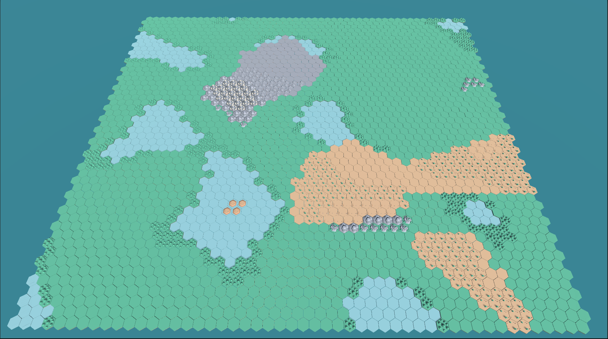


Passionate developer with 2 years of experience in the field of video game development with C#, now focused on redirecting my career towards software development in broader environments, such as C#, Java, C++, or SAP. Throughout my journey, I have cultivated a deep admiration for programming, creating innovative solutions, and teamwork. My transition to software development in general is driven by an intrinsic desire to expand my skills and contribute to diverse projects. I am committed to continuous learning and am excited about the opportunity to apply my previous knowledge in a new context, bringing creativity and technical skills to various challenges in the world of software development.

#[Resume](https://github.com/LucasGariador/Presentation/blob/master/Resume/LUCAS%20NAHUEL%20GARIADOR%20G_DEV.pdf)

# Private Prototypes

This is the description of the 2 personal projects I am currently working on, which are hosted in private repositories..

## Lo-fi Beats Basketball:

It's a small Mobile-oriented project that will feature different scenarios along with various lo-fi music playlists. All the logic for movement mechanics and shooting hoops has already been implemented..

## Bring Her Back(TBD)

This project aims to be a 3D side-view resource management game with emphasis on expanding and defending the castle where it takes place.

.gif)

# Public Proyects:

Source code for the following projects and prototypes can be found in the following repositories:

**Hex Builder**

[Code](https://github.com/LucasGariador/HexBuilder) 
[Itch.io Link](https://lucasgariador.itch.io/hex-builder)

**Crash Minigame Prototype:**

[Code](https://github.com/LucasGariador/PrototypeCrash)

 **The good driver:**
 

[Code](https://github.com/LucasGariador/GameJam)

**Stealth/Radial Inventory Prototype:**

[Code](https://github.com/LucasGariador/StealthPrototypeFirst)

**The Last Defence:** 

 
[Itch.io Link](https://lucasgariador.itch.io/)

**2DInventorySystem/Shop:**

[2D Inventory en repositorio](https://github.com/LucasGariador/TaskLSW)
